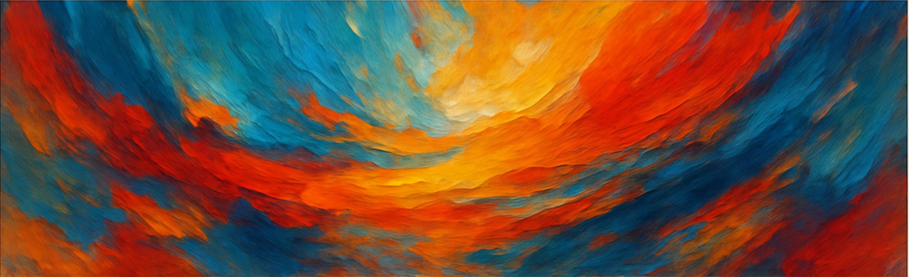

# Brushes and Palettes - Fine Art Gallery



A modern, elegant website for showcasing and selling original artwork with a unique visualization tool that allows customers to see paintings in different spaces and with various framing options.

## ✨ Features

### 🖼️ Art Gallery & Collections
- **Stunning Gallery**: Organized display of paintings by collection
- **Dynamic Filtering**: Sort by style, medium, and availability
- **Detailed Artwork Information**: Dimensions, medium, and price clearly displayed

### 🔍 Art Visualization Tool
- **Room Templates**: See artwork in living rooms, bedrooms, offices, and dining rooms
- **Frame Options**: Try different frame styles (none, thin black, modern white, classic gold, wood brown)
- **Size Customization**: Adjust artwork size to fit your space perfectly
- **Position Control**: Fine-tune placement on walls
- **Coming Soon**: Upload photos of your own spaces

### 🛒 E-commerce Features
- **Shopping Cart**: Easy to use cart system
- **Secure Checkout**: Protection for customer information
- **Order Tracking**: Updates on artwork shipment

### 🎨 Custom Commissions
- **Request System**: Commission custom artwork
- **Consultation Process**: Work directly with the artist

## 🚀 Technologies Used

- **Frontend**: Next.js 14, React, Tailwind CSS
- **State Management**: React Hooks
- **Animation**: CSS Transitions
- **Image Optimization**: Next.js Image Component
- **Responsive Design**: Mobile-First Approach

## 📋 Getting Started

### Prerequisites
- Node.js (v14.0.0 or later)
- npm or yarn

### Installation

```bash
# Clone the repository
git clone https://github.com/kinghoys/Brushes-N-Palettes.git

# Navigate to the project directory
cd Brushes-N-Palettes

# Install dependencies
npm install

# Start the development server
npm run dev
```

The site will be available at http://localhost:3000

## 🌟 Unique Selling Points

The Art Visualization Tool sets this website apart from competitors by allowing customers to:
- See artwork in realistic room settings
- Test different framing options before purchasing
- Visualize size and scale in a real environment
- Make confident buying decisions

## 📱 Responsive Design

Brushes and Palettes is fully responsive and works beautifully on:
- Desktop computers
- Tablets
- Mobile phones

## Technology Stack

- **Frontend**: Next.js with React
- **Styling**: Tailwind CSS
- **Animation**: Framer Motion
- **3D Visualization**: Three.js
- **E-commerce**: Shopify integration
- **Deployment**: Vercel

## Getting Started

1. **Install dependencies**:
   ```
   npm install
   ```

2. **Run development server**:
   ```
   npm run dev
   ```

3. **Open your browser**:
   Navigate to [http://localhost:3000](http://localhost:3000)

## Project Structure

- `/components`: Reusable UI components
- `/src/app`: Next.js application pages
- `/public`: Static assets
- `/styles`: Global CSS and Tailwind configuration

## Deployment

This website can be easily deployed to Vercel with the following command:
```
vercel
```

## License

All rights reserved.
